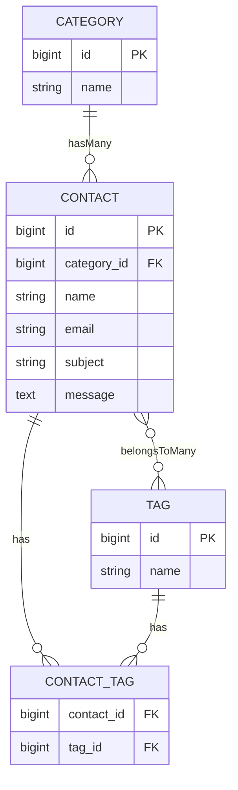

## プロジェクト名
COACHTECH お問い合わせフォーム

## 概要
プロジェクトの目的と実装機能の概要説明

## ER図

## 環境構築手順

## 使用技術
- Laravel10.4
- MySQL 8.0
- Nginx
- Docker
- phpMyAdmin

## APIエンドポイント一覧

## 開発環境URL
http://localhost

## 作成者
浅井 明日香