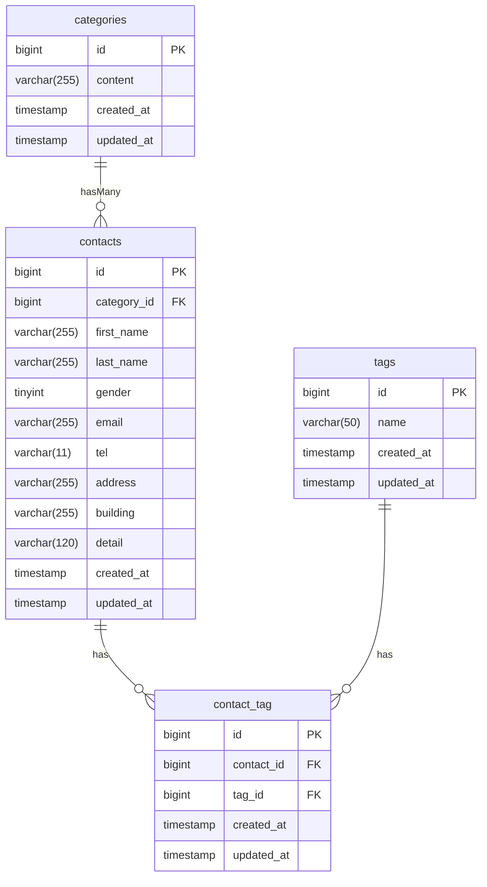

## プロジェクト名
COACHTECH お問い合わせフォーム

## 概要
本システムは、一般ユーザーが利用する公開のお問合せフォームです。  
誰でも認証なしでお問い合わせを送信でき、管理者はログイン後にその内容を確認・管理することができます。  
問い合わせ内容はカテゴリ(必須)とタグ(任意)によって分類・管理することができます。タグは管理者が任意で追加・編集・削除することが可能です。  
問い合わせ一覧をCSV形式でエクスポートすることが可能です。  
また、お問い合わせ情報を取得・管理するためのREST APIを提供しています。

## ER図


## 環境構築手順

### バックエンドのセットアップ
#### 前提環境
- Docker Desktop

1. リポジトリを取得  
任意のディレクトリでリポジトリをクローンします。
```
git clone https://github.com/Asuka-Asai06/contact-form-app.git contact-form-app
```

2. プロジェクトディレクトリに移動
```
cd contact-form-app
```

3. Composerパッケージをインストール
```
docker run --rm \
	-u "$(id -u):$(id -g)" \
	-v "$(pwd):/var/www/html" \
	-w /var/www/html \
	-e COMPOSER_CACHE_DIR=/tmp/composer_cache \
	laravelsail/php84-composer:latest \
	composer install
```

4. 環境設定ファイルをコピー
```
cp .env.example .env
```

5. Sailを起動
```
./vendor/bin/sail up -d
```

6. アプリケーションキーを生成
```
./vendor/bin/sail artisan key:generate
```

7. データベースを構築  
マイグレーションを実行します。  
```
./vendor/bin/sail artisan migrate
```

初期データが必要な場合はシーダーとまとめて実行してください。
```
./vendor/bin/sail artisan migrate --seed
```

### フロントエンドのセットアップ
1. NPM依存パッケージのインストール
```
./vendor/bin/sail npm install
```

2. Tailwind CSSのインストール ※既にTailwind CSSやAlpine.jsが導入済みの場合、この手順は不要です。  
Tailwind CSS:`./vendor/bin/sail npm install -D tailwindcss@^3.4.0 postcss autoprefixer`  
Alpine.js:`./vendor/bin/sail npm install alpinejs`

3. Vite開発サーバーの起動
```
./vendor/bin/sail npm run dev
```

### 動作確認
ブラウザで以下へアクセスしてください。  
お問い合わせフォーム:  
http://localhost  
管理者登録ページ:  
http://localhost/register

## 使用技術
### バックエンド
- PHP 8.4
- Laravel10.4
- Laravel Fortify（認証機能）
- Laravel Excel
- MySQL 8.0

### フロントエンド
- Tailwind CSS
- Vite

### 開発ツール
- Docker
- Laravel Sail
- phpMyAdmin
- Nginx
- PHPUnit（テスト）
- Postman(API動作確認)
- Git/GitHub（バージョン管理）

## APIエンドポイント一覧
| Method | Endpoint | Description |
| --- | --- | --- |
| GET | `/api/v1/contacts` | お問い合わせ一覧取得 |
| GET | `/api/v1/contacts/{id}` | お問い合わせ詳細取得 |
| POST | `/api/v1/contacts` | お問い合わせ登録 |
| PUT | `/api/v1/contacts/{id}` | お問い合わせ更新 |
| DELETE | `/api/v1/contacts/{id}` | お問い合わせ削除 |

お問い合わせ一覧の取得は検索・絞り込み機能に対応しています。
```
GET /api/v1/contacts
```
| Parameter | Type | Description |
| --- | --- | --- |
| keyword | string | 名前・メールアドレスによる部分一致検索 |
| gender | integer | 性別による絞り込み(1→男性、2→女性、3→その他) |
| category_id | integer | カテゴリーによる絞り込み |
| date | date | 登録日による絞り込み |
| per_page | integer | 1ページあたりの表示件数(最大100件) |

## 開発環境URL
http://localhost

## 作成者
浅井 明日香